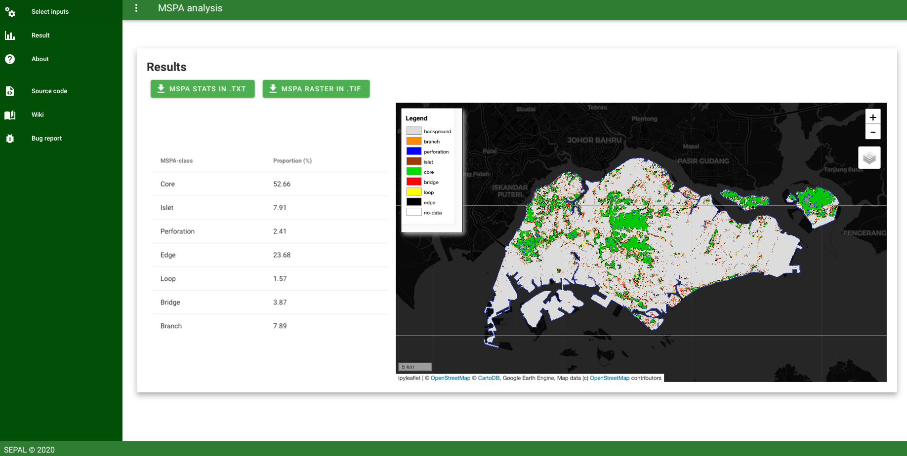

# MSPA analysis
[](LICENSE)
## About 

Module to perform MSPA analysis in the Sepal platform. The user will select a file of his choice and create its own binary map. This binary map will be used as input file of the MSPA tool. The parameters can be tuned by the user to fit its requirements.  
Note that all the output files are in EPSG:4326.  



for more information about usage please read the [documentation](./doc/doc.md)

### Background info on MSPA
MSPA (Morphological Spatial Pattern Analysis) is a customized sequence of mathematical morphological operators targeted at the description of the geometry and connectivity of the image components. Based on geometric concepts only, this methodology can be applied at any scale and to any type of digital images in any application field.

For more information please refer to:

- [Peter Vogt & Kurt Riitters (2017) GuidosToolbox: universal digital image object analysis, European Journal of Remote Sensing, 50:1, 352-361, DOI: 10.1080/22797254.2017.1330650](https://www.tandfonline.com/doi/full/10.1080/22797254.2017.1330650)
- [Guidos Toolbox](https://forest.jrc.ec.europa.eu/en/activities/lpa/mspa/) developed by JRC


## contribute
to install the project on your Sepal account 
```
$ git clone https://github.com/12rambau/mspa-analysis.git
```

please retrieve the develop branch where all our development live
```
$ git checkout --track origin/develop
```

please follow the contributing [guidelines](CONTRIBUTING.md).
