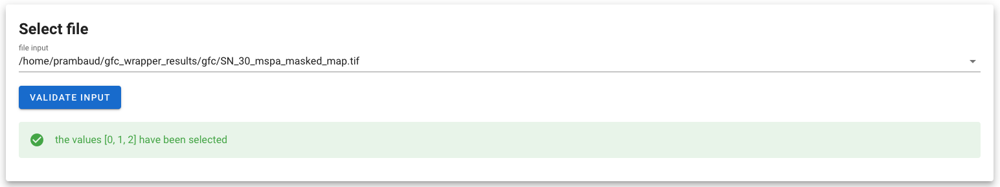
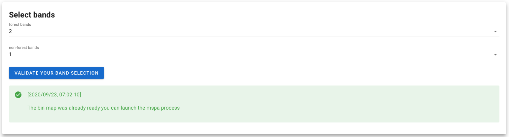
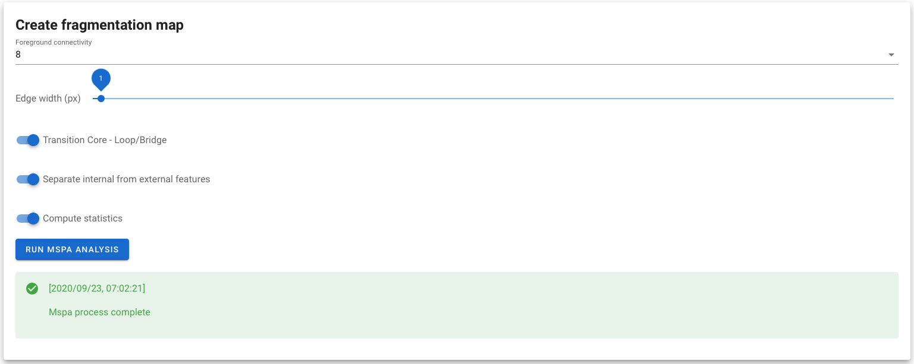
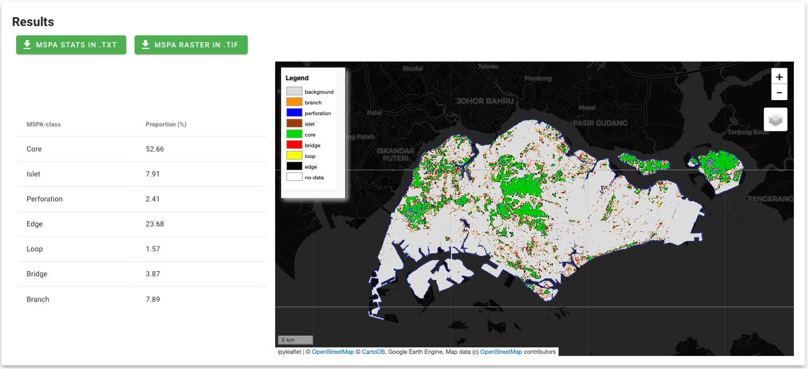

# Welcome in the user documentation 

This documentation should explain every step to execute the module. If any question or bug remains, please consider post it on the [bug report page](https://github.com/12rambau/gfc_wrapper_python/issues)

## Before starting 
This module will require the user to register to GEE instead of using the public SEPAL account. Follow this [link](https://earthengine.google.com) to create a GEE account. Once done, select your GEE account in the SEPAL bottom right corner and use your personal credentials. 


Then go to your terminal, start a `t1` session and run:  
```
$ earthengine authenticate
```

Follow the instructions provided by the command. You are now ready to go.

> :warning: **Troubleshooting:** This module is executed through a voila application that create a User Interface on top of a Jupyter notebook. The reactivity of some components will thus be a little slower than what you are used to on a standard website. Please be nice with them.

## table of content
1. [Select a file](./select_aoi.md)  
2. [Select bands](./select_aoi.md)  
3. [Tune MSPA parameters](./select_aoi.md)   
4. [Display result](./gfc_viz.md)

## Usage

### 1. Select a file

First the user need to select a Tiff file in it's sepal folder. The feature to be interpreted needs to be stored on the first band of the raster.
Once the file is selected, the dropdown menu in the `Select bands` tile will be updated with the available values of your raster. 

> the stem of your file will be used to name all the generated file. consider changing it for something shorter if it exeeds 30 characters. It will be called `[filename]` in the rest of this document. 



### 2. Select bands 

using the two dropdown menu you can now select the value that will be used for the binary map. 

MSPA analysis required 3 value (see more in there [doc](https://forest.jrc.ec.europa.eu/en/activities/lpa/mspa/)):
- 0 for non background areas (outside the aoi borders) 
- 1 for non forest areas
- 2 for forest areas 

you will select the values of forest and non forest, the unselected values will be considered as background. 

The resulting binary map can be found in `~/mspa-results/filename_bin_map.tif`.

> :warning: remember that a value cannot be selected twice



### 3. Tune MSPA parameters

Several tuning parameters are then available to the user:

- Foreground connectivity: the number of neigbours to consider to define a conex area (4 or 8)
- Edge width: the width in meter of the edge of an area. steps are based on the resolution of the initial raster.
- 3 default parameters associated to the definition of islet, perforation loop and bridges (find more about the MSPA tool).

> :warning: Before launching the process, make sure that your instance is powerful enough to run the process. m4 is the minimum for country-size computation.

Resulting map and stats can be found in `~/mspa-results/` as `filename_X_X_X_X_map.tif` and `filename_X_X_X_X_stat.txt` respectively (with `X_X_X_X` being the parameters of your MSPA analysis). 



### 4. Display results

The results tile will give you an insight of the obtained stats (in % of surfaces) and the final raster in a interactive map. 

The two green buttons allow you to directly download the resulting files

> :warning: launching the download will kill the notebook's kernel so no action will be possible afterward


